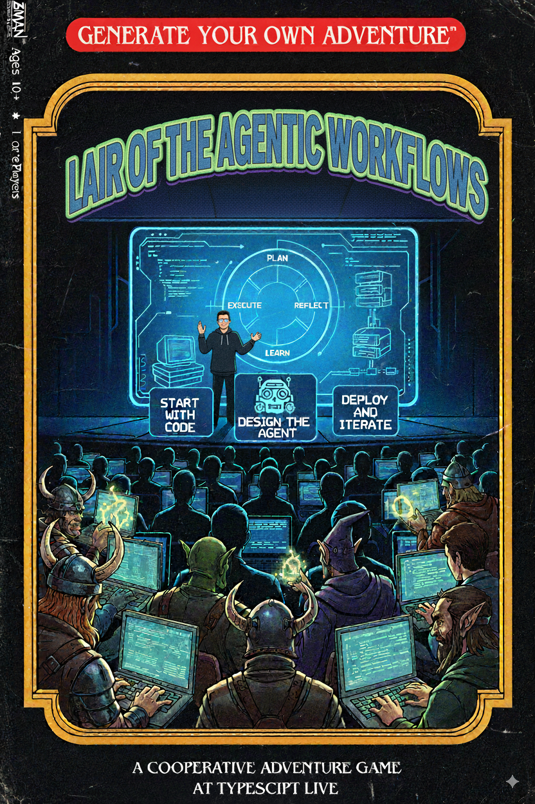

# 🎮 Agents vs Workflows

A TypeScript meetup demo showcasing **Mastra** framework capabilities for building agentic workflows - demonstrated through an interactive choose-your-own-adventure game!



## 🚀 Quick Start

### Prerequisites

- Node.js (18+)
- pnpm
- An OpenAI compatible llm running locally
  - LOCAL_OPENAI_COMPATIBLE_URL and LOCAL_OPENAI_COMPATIBLE_MODEL_NAME must be set in packages/app/.env
- OR set OPENAI_API_KEY and update all usages of openAICompatible() to use openAI()

### 📊 Run the Slides

```bash
# Install dependencies
pnpm install

# Start the slides (opens browser automatically)
pnpm slides
```

The slides will open at `http://localhost:3030`

### 🔧 Run Mastra Development Server

```bash
# Setup environment variables first
cd packages/app
cp .env.template .env
# Start Mastra dev server
pnpm app
```

The mastra playground will be accessible at `http://localhost:4111`

### 🎭 Run the Adventure Game

```bash
# Install dependencies (if not done already)
pnpm install

# Play the interactive adventure
pnpm play
```

## 📁 Project Structure

```
├── packages/
│   ├── slides/           # Slidev presentation
│   │   ├── slides.md     # Main presentation content
│   │   └── assets/       # Images and resources
│   └── app/              # Mastra adventure game
│       ├── src/mastra/   # Mastra configuration
│       │   ├── agents/   # AI agents (character, story)
│       │   ├── tools/    # External integrations (weather, names)
│       │   └── workflows/# Adventure game workflow logic
│       └── play-adventure.ts  # CLI game interface
```
