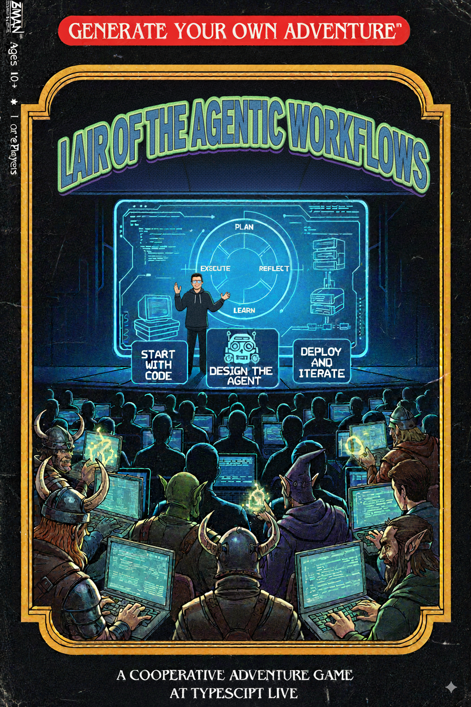

# Agents vs Workflows

## ..and sometimes agentic workflows

by **Raúl Pineda** (that's me)

at **TypeScript Live** September 2025


---

# ¡Hola!

## About me

- 🇲🇽 Originally from Mexico
- 🇩🇰 Lived and worked in Denmark for many years
- Frontend|Front End|UI|Product Engineer
  - 🍷 Vivino
  - 📈 Saxo Bank
  - 🤖 DataRobot
- Worked in the AI industry since 2019

---
layout: section
---

# AI Applications
_an abridged history_


<!--
  Predictive: classification, regression, scenario modeling, anomaly detection
  Chatbots: Just interact with an llm, maybe add memory and context
  Multimodal: Consume images, documents
  Agentic: Let the LLM use tools before returning
-->

---

# The problem

- I don't like Python
- I really don't like Streamlit
- Agentic apps are too non-deterministic


---
layout: two-cols
background: ./assets/background.jpg
---

# The solution (hopefully)


::right::

## Nice stuff

- Open Source
- Typescript-only
- Built on top of AISDK
- Features
  - Agents
  - Workflows 
  - MCP
  - RAG
  - Evals
  - OTEL

<!-- 
  Remark I'm not affiliated with Mastra and that other brands are available
  Building on top of AISDK means that openai, gemini, anthropic, etc is available through the same abstractions
-->

---

# Just a TypeScript class

```ts
// src/mastra/index.ts

export const mastra = new Mastra({
  agents: { funnyAgent },
  workflows: { questionsWorkflow },
  // storage
  // logger
  // telemetry
  // mcpServers
  // networks
  // vectors
  // etc
});
```

---
layout: two-cols
---

# Agents

```ts
export const funnyAgent = new Agent({
  name: "funny-agent",
  model: openai("gpt-5"),
  instructions: `
    You are a humorous agent that comes up with witty
    remarks based on some arbitrary input.
  `,
  tools: { humorAssessmentTool }
});
```

::right::

# Workflows

```ts
const questionsWorkflow = createWorkflow({
  id: "questions-workflow",
  inputSchema: z.object({ question: z.string() }),
  outputSchema: z.object({ answer: z.string() }),
  steps: [
    interpretQuestion,
    research, 
    makeItFunny
  ]
})
  // parse the user intent and come up with a plan
  .then(interpretQuestion) 
  // execute the plan using some resources
  .then(research)
  // Summarize the answer and present it as a joke
  .then(makeItFunny); 

  myWorkflow.commit();

  export { myWorkflow };
```

---
layout: cover
---

# Let's look at some code

Weather and activity planning workflow as the TodoMVC of the agentic world

---
layout: two-cols
---

# Putting it all together

Let's use mastra agents and workflows to generate a little text-based game.

Some features we'll use are:

- Calling agents from workflows 🤵
- Looping within a workflow 🔁
- Awaiting for human in the loop interactions ⏳
- Calling workflows from other workflows 🤯


::right::


---
layout: cover
---

# Thank you
Say _hej[at]raulpineda[dot]mx_ or _raulpineda_ on LinkedIn

---
layout: cover
---

